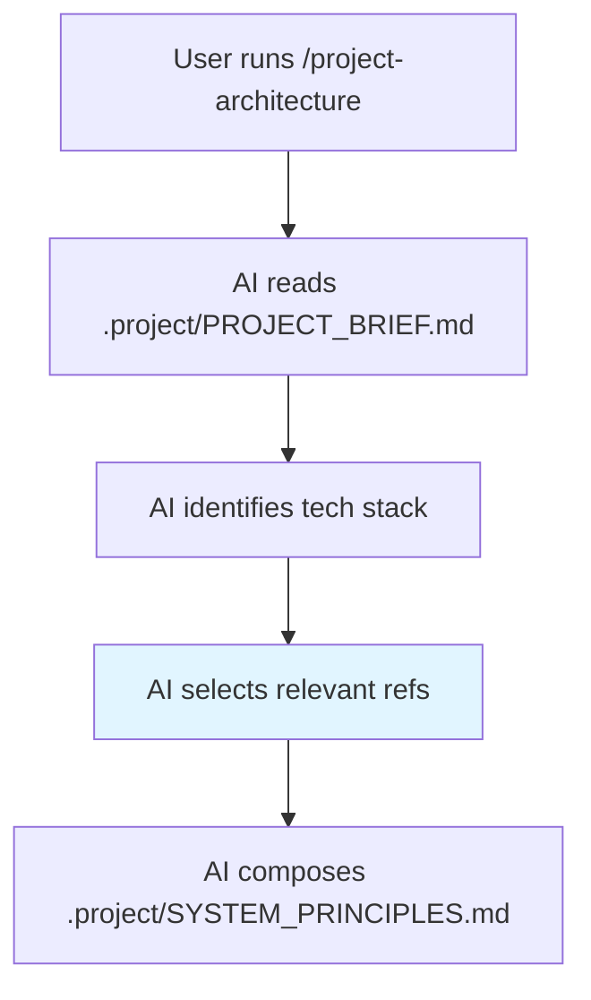

# 📚 Agent Reference Library

> **Purpose:** Reusable templates for `/project-architecture` workflow to compose project-specific `.project/` files.

---

## 📁 Structure

```
refs/
├── README.md                    # This file
├── monorepo-template/           # Turborepo + pnpm workspace setup
│   └── architecture-rules.md
└── app-starter/                 # Per-technology templates
    ├── nestjs/
    │   ├── architecture-rules.md
    │   └── coding-standards.md
    ├── nextjs/
    │   ├── architecture-rules.md
    │   └── coding-standards.md
    ├── nuxtjs/
    │   ├── architecture-rules.md
    │   └── coding-standards.md
    └── reactjs-vite/
        ├── architecture-rules.md
        └── coding-standards.md
```

---

## 🔄 Workflow



---

## 📋 Usage

### `/project-architecture` Workflow

1. **Read** `PROJECT_BRIEF.md` for tech choices
2. **Select** refs based on stack:
   - Monorepo? → `monorepo-template/`
   - NestJS backend? → `app-starter/nestjs/`
   - React frontend? → `app-starter/reactjs-vite/`
3. **Compose** sections into `SYSTEM_PRINCIPLES.md`
4. **Replace** placeholders:
   - `{{PROJECT_NAME}}` → actual project name
   - `{{PACKAGE_PREFIX}}` → e.g., `@personal-life-os`

---

## 🏷️ Placeholders

| Placeholder | Replace With | Example |
|-------------|--------------|---------|
| `{{PROJECT_NAME}}` | Project folder name | `personal-life-os` |
| `{{PACKAGE_PREFIX}}` | Package scope | `@personal-life-os` |

---

## 📝 File Contents

### `architecture-rules.md`
- Folder structure
- Layer rules (API, Application, Domain, Infrastructure)
- Naming conventions
- AI coding checklist

### `coding-standards.md`
- Code style (immutability, imports, types)
- Testing patterns (AAA)
- Error handling
- Comments & documentation

---

## ⚠️ Important

- **Refs are read-only** — Never modify during project work
- **Agents reference `.project/*` only** — Not refs directly
- **Update refs manually** — When best practices change

---

*Last updated: 2025-12-31*
