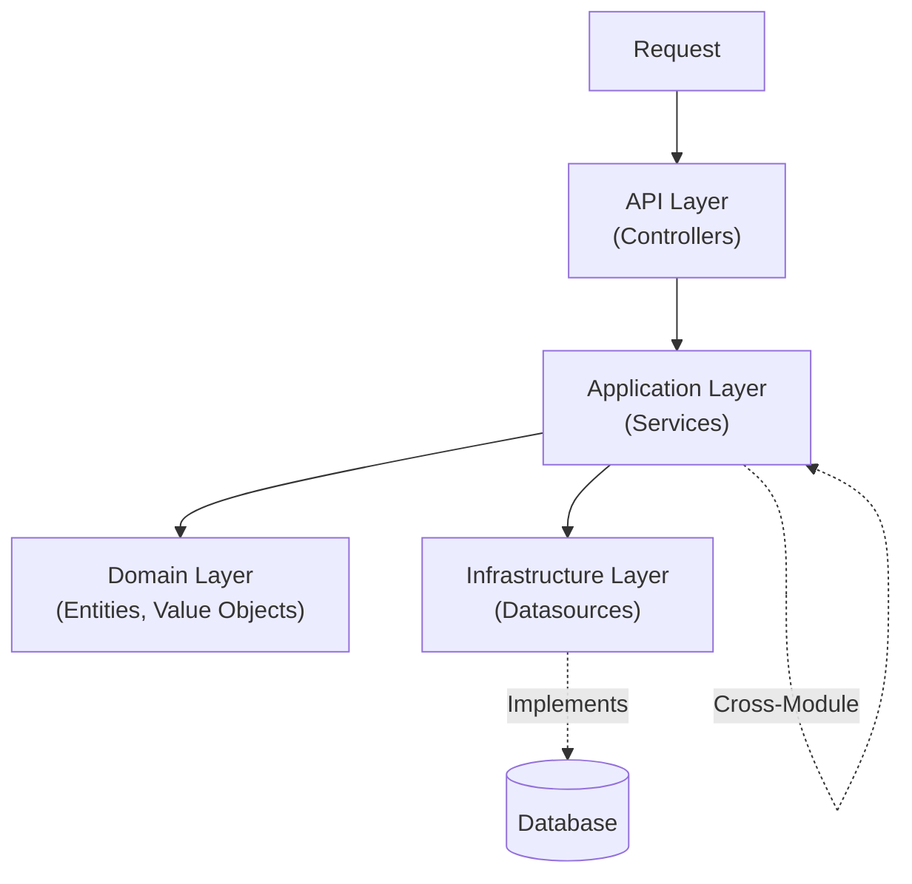

# NestJS Clean Modular Monolith — AI Coding Rules

> **PURPOSE:** This document defines architecture patterns for NestJS backend applications.  
> **AUDIENCE:** AI agents designing, generating, or reviewing NestJS code.  
> **ENFORCEMENT:** Any code violating "Hard Boundaries" or "Forbidden" rules is a critical failure.

---

## 1) System Architecture



**Hard Boundaries:**
- **API Layer**: Entry point only. NO business logic. NO database access. MUST use Centralized Routes.
- **Application Layer**: Use-cases for domain. MAY import Services from other Modules (use `forwardRef` if circular).
- **Domain Layer**: Entities, Value Objects, Enums. NO external dependencies.
- **Infrastructure Layer**: Database operations. MUST use Interface-based DI.

---

## 2) Folder Structure

**Rule for AI:** When creating a new module, generate **all 4 layers** in one module folder.

```text
src/
├── main.ts
├── app.module.ts
│
├── routes/                           # 📍 Centralized Route Definitions
│   └── app-routes.constant.ts        # Single Source of Truth (V1, V2...)
│
├── modules/                          # 🎯 Domain Modules (Independent Silos)
│   └── {module}/
│       ├── api/                      # Presentation Layer
│       │   ├── controllers/
│       │   │   ├── {module}.controller.ts      # V1 Controller
│       │   │   └── {module}.v2.controller.ts   # V2 Controller (if exists)
│       │   ├── dtos/
│       │   │   ├── requests/
│       │   │   └── responses/
│       │   └── swagger/
│       │
│       ├── application/              # Application Layer (Module Logic)
│       │   ├── {module}.service.ts
│       │   ├── {module}.service.spec.ts
│       │   └── models/
│       │       ├── inputs/
│       │       └── outputs/
│       │
│       ├── domain/                   # Domain Layer (Pure Rules)
│       │   ├── entities/
│       │   ├── value-objects/
│       │   └── enums/
│       │
│       ├── infrastructure/           # Infrastructure Layer (Data Access)
│       │   └── datasources/
│       │       ├── {module}.datasource.interface.ts
│       │       └── {module}.prisma.datasource.ts
│       │
│       ├── exceptions/
│       │   └── {module}.exception.ts
│       │
│       └── {module}.module.ts
│
├── core/                             # ⚙️ Core Infrastructure
│   ├── auth/
│   ├── database/
│   ├── config/
│   └── interceptors/
│
├── shared/                           # 🔧 Shared Utilities
│   ├── decorators/
│   ├── dtos/
│   ├── models/
│   ├── enums/
│   ├── exceptions/
│   ├── filters/
│   ├── pipes/
│   ├── swagger/
│   └── utils/
│
└── constants/
    ├── error-code.constant.ts
    └── error-message.constant.ts
```

---

## 3) Polyrepo vs Monorepo

| Type | Database Location | Import Pattern |
|------|-------------------|----------------|
| **Polyrepo** | `src/database/prisma/` | `import { PrismaClient } from '@prisma/client'` |
| **Monorepo** | `packages/database/prisma/` | `import { PrismaClient } from '@repo/database'` |

### Path Aliases (tsconfig.json)
```json
{
  "baseUrl": "./",
  "paths": {
    "@app/*": ["src/*"]
  }
}
```

**Monorepo เพิ่มเติม:** `"@repo/database"`, `"@repo/shared"`

---

## 4) Layer Rules & Responsibility

### 4.1 API Layer (`modules/{module}/api/`)
- **Responsibility:** Controllers, DTO Validation, Swagger.
- **Forbidden:** Logic implementation, DB access.
- **Route Rule:** MUST use constants from `src/routes/app-routes.constant.ts`.

### 4.2 Application Layer (`modules/{module}/application/`)
- **Responsibility:** Module use-cases + orchestrating cross-module logic.
- **Cross-Module:** MAY import Services from other Modules.
- **Circular Dependency:** Use `forwardRef()` if circular import occurs.
- **Injection:** MUST use `@Inject(TOKEN)` with Interface for Datasources.
- **Forbidden:**
  - ❌ Importing `PrismaService` directly.
  - ❌ Using DTOs (use Input Models).
  - ❌ Returning Entities (use Output Models).

```typescript
// ✅ CORRECT - Import Service from other Module
constructor(
  @Inject(ORDER_DATASOURCE) 
  private readonly orderDatasource: OrderDatasource,
  private readonly productService: ProductService, // ✅ Cross-module
) {}

// ✅ CORRECT - forwardRef if circular
imports: [forwardRef(() => ProductModule)]
```

### 4.3 Domain Layer (`modules/{module}/domain/`)
- **Responsibility:** Pure Business Logic (Entities, Value Objects).
- **Forbidden:** External dependencies, database access, framework code.

### 4.4 Infrastructure Layer (`modules/{module}/infrastructure/`)
- **Responsibility:** Database operations.
- **Transaction Rule:** MUST inject `TransactionHost<TransactionalAdapterPrisma>` instead of `PrismaService` to support `nestjs-cls`.
- **Pattern:** Interface + Implementation (Dependency Inversion).
- **Required:** `transformEntity()` method.

```typescript
// {module}.datasource.interface.ts
export const USER_DATASOURCE = Symbol('USER_DATASOURCE');
export interface UserDatasource {
  findById(id: string): Promise<UserEntity | null>;
  create(data: CreateUserData): Promise<UserEntity>;
}

// {module}.prisma.datasource.ts
import { TransactionHost } from '@nestjs-cls/transactional';
import { TransactionalAdapterPrisma } from '@nestjs-cls/transactional-adapter-prisma';

@Injectable()
export class UserPrismaDatasource implements UserDatasource {
  constructor(
    private readonly txHost: TransactionHost<TransactionalAdapterPrisma>,
  ) {}
  
  async findById(id: string): Promise<UserEntity | null> {
    // 💡 .tx accesses the current transaction context (or default client)
    const user = await this.txHost.tx.user.findUnique({ where: { id } });
    return user ? this.transformEntity(user) : null;
  }
  
  private transformEntity(prisma: User): UserEntity {
    return new UserEntity({ id: prisma.id, email: prisma.email });
  }
}
```

---

## 5) Transaction Management (Unit of Work)

**Mechanism:** Use `nestjs-cls` with `@Transactional()` decorator.

### 5.1 Cross-Module Transaction

```typescript
// modules/order/application/order.service.ts
import { Transactional } from '@nestjs-cls/transactional';

@Injectable()
export class OrderService {
  constructor(
    @Inject(ORDER_DATASOURCE) private orderDatasource: OrderDatasource,
    private readonly productService: ProductService, // Cross-module
  ) {}

  @Transactional() // ✅ Transaction in Service
  async create(input: CreateOrderInput) {
    // 1. Validate product availability
    const validation = await this.productService.validateForOrder(input.items);
    if (!validation.valid) throw OrderException.productValidationFailed();

    // 2. Create order
    const order = await this.orderDatasource.create(input);

    // 3. Deduct stock (if fails → rollback order)
    await this.productService.deductStock(input.items);

    return order;
  }
}
```

### 5.2 When to Use Transactions

| Scenario | Use Transaction? | Location |
|----------|-----------------|----------|
| Single module CRUD | ❌ No | Service |
| Cross-module operation | ✅ Yes | Service (caller) |
| Async side effects | ❌ No | Event Emitter |

---

## 6) Route Management (Strict Centralization)

**Objective:** Enable easy searching/debugging and maintain strict version control.
**Location:** `src/routes/app-routes.constant.ts`

```typescript
const PREFIX = { V1: 'v1', V2: 'v2' };

export const ROUTES = {
  // 🟢 VERSION 1
  V1: {
    COLLECTION: {
      ROOT: `${PREFIX.V1}/collections`,
      BY_ID: ':id',
    },
    REMINDER: {
      ROOT: `${PREFIX.V1}/reminders`,
      BY_ID: ':id',
      COMPLETE: ':id/complete',
    }
  },
  // 🔵 VERSION 2 (Incremental Rollout)
  V2: {
    COLLECTION: {
      ROOT: `${PREFIX.V2}/collections`,
      BY_ID: ':id',
    },
  }
} as const;
```

### Controller Usage

**Rule:** NEVER hardcode path strings in Controllers. Always import from `ROUTES`.

```typescript
import { ROUTES } from '@app/routes/app-routes.constant';

@Controller(ROUTES.V1.COLLECTION.ROOT)
export class CollectionController {
  
  @Get() 
  findAll() {}

  @Get(ROUTES.V1.COLLECTION.BY_ID)
  findOne(@Param('id') id: string) {}
}
```

**V2 Controller (Separate File):**

```typescript
@Controller(ROUTES.V2.COLLECTION.ROOT)
export class CollectionV2Controller {
  @Get(ROUTES.V2.COLLECTION.BY_ID)
  async findOne(@Param('id') id: string) {
    // Logic for V2 (e.g., different response structure)
  }
}
```

---

## 7) Data Transformation

| Type | Location | Purpose |
|------|----------|---------|
| **DTO** | `api/dtos/` | HTTP Contract (class-validator) |
| **Input Model** | `application/models/inputs/` | Service input |
| **Output Model** | `application/models/outputs/` | Service output |
| **Entity** | `domain/entities/` | Rich domain object |
| **Value Object** | `domain/value-objects/` | Immutable domain value |

**Flow:**
```
HTTP Request → DTO → Input Model → Entity → Output Model → Response DTO
```

**Strict Rules:**
- Services NEVER see DTOs
- Controllers NEVER see Entities

---

## 8) File Naming Conventions

| Type | Pattern | Example |
|------|---------|---------|
| Controller (V1) | `{module}.controller.ts` | `collection.controller.ts` |
| Controller (V2) | `{module}.v2.controller.ts` | `collection.v2.controller.ts` |
| Service | `{module}.service.ts` | `collection.service.ts` |
| DTO | `{action}-{module}.dto.ts` | `create-collection.dto.ts` |
| Input Model | `{action}-{module}.input.ts` | `create-collection.input.ts` |
| Output Model | `{module}.output.ts` | `collection.output.ts` |
| Entity | `{module}.entity.ts` | `collection.entity.ts` |
| Value Object | `{name}.vo.ts` | `isbn.vo.ts` |
| Datasource Interface | `{module}.datasource.interface.ts` | `collection.datasource.interface.ts` |
| Datasource Impl | `{module}.prisma.datasource.ts` | `collection.prisma.datasource.ts` |
| Exception | `{module}.exception.ts` | `collection.exception.ts` |
| Enum | `{name}.enum.ts` | `collection-type.enum.ts` |

---

## 9) Cross-Module Communication

**Rule:** Services MAY import other Services directly. Use `forwardRef()` if circular.

### Scenario A: Validation + Action (e.g., Order needs to check and deduct Product stock)

```typescript
// OrderService imports ProductService
@Injectable()
export class OrderService {
  constructor(
    @Inject(ORDER_DATASOURCE) private datasource: OrderDatasource,
    private readonly productService: ProductService, // ✅ Direct import
  ) {}

  @Transactional()
  async create(input: CreateOrderInput) {
    // Use ProductService methods directly
    const validation = await this.productService.validateForOrder(input.items);
    if (!validation.valid) throw OrderException.productValidationFailed();
    
    const order = await this.datasource.create(input);
    await this.productService.deductStock(input.items);
    
    return order;
  }
}
```

### Scenario B: Circular Dependency (e.g., Order ↔ Product)

```typescript
// order.module.ts
@Module({
  imports: [forwardRef(() => ProductModule)], // ✅ Break circular
  // ...
})

// order.service.ts
constructor(
  @Inject(forwardRef(() => ProductService))
  private readonly productService: ProductService,
) {}
```

### Scenario C: Async Side Effects

- **Pattern:** Event Emitter (non-blocking)
- **Naming:** `domain.entity.action` (past tense)
- Examples: `order.created`, `user.password.changed`

---

## 10) Error Handling

### Error Code & Message Constants
```typescript
// constants/error-code.constant.ts
export const ERROR_CODE = {
  // Global
  VALIDATE_ERROR: 100400,
  NOT_FOUND: 100404,
  INTERNAL_SERVER_ERROR: 100500,
  
  // Auth
  UNAUTHORIZED: 101401,
  INVALID_TOKEN: 101403,
  
  // User (module prefix: 102)
  USER_NOT_FOUND: 102404,
  USER_ALREADY_EXISTS: 102409,
} as const;

// constants/error-message.constant.ts
import { ERROR_CODE } from './error-code.constant';

export const ERROR_MESSAGE: Record<number, string> = {
  [ERROR_CODE.VALIDATE_ERROR]: 'Validation failed',
  [ERROR_CODE.NOT_FOUND]: 'Resource not found',
  [ERROR_CODE.USER_NOT_FOUND]: 'User not found',
  [ERROR_CODE.USER_ALREADY_EXISTS]: 'User already exists',
};
```

### Base Exception Class
```typescript
// shared/exceptions/app.exception.ts
import { ERROR_MESSAGE } from '@app/constants/error-message.constant';
import { HttpException, HttpStatus } from '@nestjs/common';

interface AppExceptionOptions {
  errorCode: number;
  statusCode: HttpStatus;
  errors?: string[] | Record<string, string[]>;
}

export class AppException extends HttpException {
  public readonly errorCode: number;
  public readonly statusCode: number;
  public readonly errors?: Record<string, string[]> | string[];

  constructor(options: AppExceptionOptions) {
    const { errorCode, statusCode, errors } = options;

    super(
      {
        errorCode,
        errorMessage: ERROR_MESSAGE[errorCode] ?? 'Unknown error',
        errors,
      },
      statusCode,
    );

    this.errorCode = errorCode;
    this.statusCode = statusCode;
    this.errors = errors;
  }
}
```

### Module-Specific Exception Factory
```typescript
// modules/collection/exceptions/collection.exception.ts
import { ERROR_CODE } from '@app/constants/error-code.constant';
import { AppException } from '@app/shared/exceptions/app.exception';
import { HttpStatus } from '@nestjs/common';

export class CollectionException {
  static notFound(): never {
    throw new AppException({
      errorCode: ERROR_CODE.COLLECTION_NOT_FOUND,
      statusCode: HttpStatus.NOT_FOUND,
    });
  }

  static alreadyExists(field: string): never {
    throw new AppException({
      errorCode: ERROR_CODE.COLLECTION_ALREADY_EXISTS,
      statusCode: HttpStatus.CONFLICT,
      errors: [`${field} already exists`],
    });
  }
}
```

### Usage in Service
```typescript
// ✅ CORRECT - Void function, throws directly
async findById(id: string): Promise<CollectionOutput> {
  const entity = await this.datasource.findById(id);
  if (!entity) {
    CollectionException.notFound(); // throws, never returns
  }
  return CollectionOutput.fromEntity(entity);
}
```

### Exception Filter (Global)
```typescript
// core/exceptions/http-exception.filter.ts
@Catch()
export class HttpExceptionFilter implements ExceptionFilter {
  catch(exception: unknown, host: ArgumentsHost) {
    // Handles AppException and formats response consistently
    // See scaffolds/core/exceptions/ for full implementation
  }
}
```

**Rules:**
- **Define:** Error codes in `constants/error-code.constant.ts`
- **Throw:** Use module-specific exception factories with `: never` return type
- **Forbidden:** Generic `Error` or `HttpException` in services

---

## 11) Enum Strategy

**Philosophy:** Avoid Prisma enums. Use String columns with TypeScript enums.

```prisma
// ✅ CORRECT
model User {
  status String @default("active") @db.VarChar(20)
}
```

```typescript
export enum CommonStatus {
  ACTIVE = 'active',
  INACTIVE = 'inactive',
}

export type CommonStatusType = `${CommonStatus}`;
```

**Location:**
- **Shared Enums:** `src/shared/enums/`
- **Module Enums:** `modules/{module}/domain/enums/`

---

## 12) Pagination

**Strict Rule:** Use shared models only (`PaginateQueryDto`, `PaginateInput`, `PaginatedOutput<T>`).

| Layer | Class | Location |
|-------|-------|----------|
| **API** | `PaginateQueryDto` | `shared/dtos/pagination/` |
| **Application** | `PaginateInput` | `shared/models/pagination/` |
| **Application** | `PaginatedOutput<T>` | `shared/models/pagination/` |

```typescript
// Datasource usage
return prismaPaginate(this.txHost.tx.collection, {
  where: { userId: input.userId },
  orderBy: { createdAt: 'desc' },
}, input, this.transformEntity);
```

---

## 13) Auth & JWT

### Base Payload
```typescript
// core/auth/interfaces/jwt-base-payload.interface.ts
export interface JwtBasePayload {
  uid: string;  // User ID (mandatory)
  sid: string;  // Session ID (mandatory)
}
```

### Extended Payload
```typescript
// core/auth/interfaces/jwt-payload.interface.ts
export interface JwtPayload extends JwtBasePayload {
  role?: string;
  permissions?: string[];
}
```

### Rules
- **Mandatory Fields:** `uid` (User ID), `sid` (Session ID)
- **Extension:** MAY extend JwtBasePayload for additional claims
- **Prohibition:** MUST NOT modify Base Payload shape

### Current User Decorator
```typescript
// core/auth/decorators/current-user.decorator.ts
export const CurrentUser = createParamDecorator(
  (data: keyof JwtPayload | undefined, ctx: ExecutionContext) => {
    const request = ctx.switchToHttp().getRequest();
    const user = request.user as JwtPayload;
    return data ? user?.[data] : user;
  },
);

// Usage
@Get('profile')
getProfile(@CurrentUser() user: JwtPayload) {}

@Get('id')
getUserId(@CurrentUser('uid') userId: string) {}
```

---

## 14) Swagger

### @ApiResponses Decorator
```typescript
// shared/decorators/api-response.decorator.ts
import { applyDecorators, Type } from '@nestjs/common';
import { ApiResponse, ApiResponseOptions } from '@nestjs/swagger';

type ExtendedApiResponseOptions = ApiResponseOptions & {
  type?: Type<unknown>;
};

export function ApiResponses(
  responses: ExtendedApiResponseOptions[],
): ReturnType<typeof applyDecorators> {
  const decorators = responses.map((res) => ApiResponse(res));
  return applyDecorators(...decorators);
}
```

### SwaggerHelpers Class
```typescript
// shared/swagger/swagger.helpers.ts
import { ERROR_CODE } from '@app/constants/error-code.constant';
import { ERROR_MESSAGE } from '@app/constants/error-message.constant';

export class SwaggerHelpers {
  static success(status: number, example: any, description = 'Success') {
    return { status, description, examples: { Success: { value: example } } };
  }

  static validationError(customErrors?: Record<string, string[]>) {
    return {
      status: 400,
      description: 'Bad Request',
      examples: {
        'Error: Validation Error': {
          value: {
            status: { code: 400, message: 'Bad Request' },
            error: {
              code: ERROR_CODE.VALIDATE_ERROR,
              message: ERROR_MESSAGE[ERROR_CODE.VALIDATE_ERROR],
              errors: customErrors || { field: ['field is required'] },
            },
          },
        },
      },
    };
  }

  static unauthorized() { /* ... */ }
  static notFound(resourceName: string) { /* ... */ }
  static conflict(errorCode: number, message: string) { /* ... */ }
  static paginated<T>(items: T[], description = 'Success') { /* ... */ }
}
```

### Response Files (Array Format)
```typescript
// modules/{module}/api/swagger/create-collection.response.ts
import { SwaggerHelpers } from '@app/shared/swagger/swagger.helpers';
import { ERROR_CODE } from '@app/constants/error-code.constant';

const collectionExample = {
  id: 'uuid',
  title: 'My Collection',
  createdAt: '2024-01-01T00:00:00.000Z',
};

export const createCollectionResponse = [
  SwaggerHelpers.success(201, collectionExample, 'Collection created'),
  SwaggerHelpers.validationError({ title: ['title is required'] }),
  SwaggerHelpers.conflict(ERROR_CODE.COLLECTION_ALREADY_EXISTS, 'Collection already exists'),
];

export const getCollectionResponse = [
  SwaggerHelpers.success(200, collectionExample),
  SwaggerHelpers.unauthorized(),
  SwaggerHelpers.notFound('Collection'),
];
```

### Barrel Export
```typescript
// modules/{module}/api/swagger/index.ts
export { createCollectionResponse } from './create-collection.response';
export { getCollectionResponse } from './get-collection.response';
```

### Usage in Controller (Clean)
```typescript
import { ApiResponses } from '@app/shared/decorators/api-response.decorator';
import { createCollectionResponse, getCollectionResponse } from '../swagger';

@ApiTags('Collection')
@Controller(ROUTES.V1.COLLECTION.ROOT)
export class CollectionController {
  
  @ApiOperation({ summary: 'Create collection' })
  @ApiResponses(createCollectionResponse)  // ✅ Single decorator, all responses
  @Post()
  create(@Body() dto: CreateCollectionDto) {}

  @ApiOperation({ summary: 'Get collection by ID' })
  @ApiResponses(getCollectionResponse)
  @Get(':id')
  findOne(@Param('id') id: string) {}
}
```

**Benefits:**
- ✅ Single `@ApiResponses()` decorator instead of multiple `@ApiResponse()`
- ✅ Consistent error response format across all endpoints
- ✅ Easy to reuse response definitions
- ✅ Swagger documentation matches actual error responses

---

## 15) Module Registration

### Module DI Pattern
```typescript
@Module({
  controllers: [CollectionController],
  providers: [
    CollectionService,
    { provide: COLLECTION_DATASOURCE, useClass: CollectionPrismaDatasource },
  ],
  exports: [CollectionService, COLLECTION_DATASOURCE],
})
export class CollectionModule {}
```

### App Module Registration Order
1. **ConfigModule** — Always first (isGlobal: true)
2. **ClsModule** — For transaction management (`ClsPluginTransactional` + `TransactionalAdapterPrisma`)
3. **Core Modules** — Database, Auth, Health
4. **Domain Modules** — Feature modules (alphabetical order)

**Note:** See `scaffolds/app.module.ts` for full ClsModule configuration.

---

## 16) Testing Strategy

### Test Types & Locations

| Type | Location | Pattern | Purpose |
|------|----------|---------|---------|
| **Unit** | `modules/{module}/application/*.spec.ts` | `{module}.service.spec.ts` | Service logic |
| **Contract** | `test/api/v1/` | `{module}.contract.spec.ts` | API response shape |
| **Flow** | `test/flows/` | `{action}-{module}.flow.spec.ts` | E2E user journey |
| **Integration** | `test/integration/` | `{module}.integration.spec.ts` | Database operations |

### AAA Pattern (Unit Tests)
```typescript
it('should create', async () => {
  // Arrange
  const input = { title: 'Test' };
  jest.spyOn(datasource, 'create').mockResolvedValue(mockEntity);
  // Act
  const result = await service.create(input);
  // Assert
  expect(result.id).toBe('1');
});
```

**Note:** See `scaffolds/` for full test examples.

---

## 17) AI Coding Checklist

Before generating code:

- [ ] **4 Layers:** Created api, application, domain, infrastructure folders?
- [ ] **Controllers folder:** Controller is in `api/controllers/`?
- [ ] **Routes:** Defined in `app-routes.constant.ts`? No hardcoded strings?
- [ ] **Infra:** Injecting `TransactionHost` instead of `PrismaService`?
- [ ] **Injection:** Using `@Inject(TOKEN)` with Interface for Datasources?
- [ ] **Cross-Module:** Using `forwardRef()` if circular dependency?
- [ ] **Transaction:** `@Transactional()` in Service (caller) for cross-module?
- [ ] **Types:** Passing DTOs to Service? → Use Input Model
- [ ] **Return:** Returning Prisma object? → Map to Output Model
- [ ] **Swagger:** Created swagger response files?
- [ ] **Path Alias:** Using `#modules`, `#shared`, etc.?

---

## 18) Coding Standards

**Reference:** See `coding-standards.md` for detailed style guide.

**Quick Rules:**
- Prefer `const`, use `readonly` in models
- Functions: RO-RO pattern (Receive Object, Return Object)
- Control Flow: Early returns, avoid nesting
- Testing: AAA pattern (Arrange-Act-Assert)

---

*End of Architecture Rules (Merged v1 + v3)*
