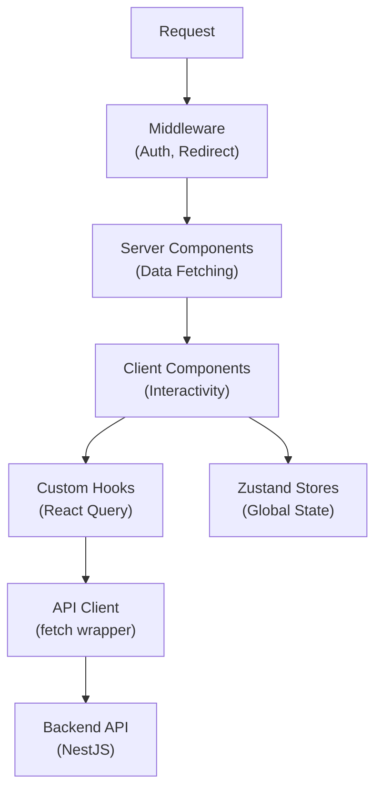

# Next.js App Router — AI Coding Rules

> **PURPOSE:** This document defines architecture patterns for Next.js App Router applications.  
> **AUDIENCE:** AI agents designing, generating, or reviewing Next.js code.  
> **STACK:** Next.js 15 + React 19 + shadcn/ui + Tailwind + React Query + Zustand

---

## 1) System Architecture



**Boundaries:**
- **Server Components (RSC)**: Data fetching, SEO, static content
- **Client Components**: Interactivity, hooks, browser APIs
- **API Client**: All HTTP requests go through centralized client
- **Stores**: Client-side global state only

---

## 2) Folder Structure

```
apps/web/src/
├── app/                          # App Router
│   ├── layout.tsx                # Root layout (providers)
│   ├── page.tsx                  # Home page
│   ├── loading.tsx               # Global loading
│   ├── error.tsx                 # Global error
│   ├── not-found.tsx             # 404 page
│   │
│   ├── (auth)/                   # Auth route group (minimal layout)
│   │   ├── login/page.tsx
│   │   ├── register/page.tsx
│   │   └── layout.tsx
│   │
│   ├── (public)/                 # Public route group (header/footer)
│   │   ├── about/page.tsx
│   │   ├── pricing/page.tsx
│   │   └── layout.tsx
│   │
│   ├── (dashboard)/              # Dashboard route group (sidebar)
│   │   ├── layout.tsx
│   │   ├── page.tsx              # Dashboard home
│   │   └── collection/
│   │       ├── page.tsx          # List
│   │       └── [id]/page.tsx     # Detail
│   │
│   └── api/                      # Route Handlers (if needed)
│       └── [...]/route.ts
│
├── components/
│   ├── ui/                       # shadcn/ui components
│   │   ├── button.tsx
│   │   ├── card.tsx
│   │   ├── dialog.tsx
│   │   └── ...
│   │
│   ├── layout/                   # Layout components
│   │   ├── header.tsx
│   │   ├── sidebar.tsx
│   │   ├── footer.tsx
│   │   └── providers.tsx
│   │
│   └── features/                 # Feature components
│       └── {feature}/
│           ├── {feature}-list.tsx
│           ├── {feature}-card.tsx
│           └── {feature}-form.tsx
│
├── hooks/                        # Custom hooks
│   ├── queries/                  # React Query hooks
│   │   ├── use-collections.ts
│   │   └── use-collection.ts
│   ├── mutations/                # Mutation hooks
│   │   └── use-create-collection.ts
│   └── use-auth.ts               # Auth hook
│
├── lib/                          # Utilities
│   ├── api-client.ts             # Fetch wrapper
│   ├── utils.ts                  # cn() helper
│   └── validations/              # Zod schemas
│       ├── collection.ts
│       └── auth.ts
│
├── stores/                       # Zustand stores
│   ├── auth-store.ts
│   └── ui-store.ts
│
├── types/                        # TypeScript types
│   ├── api.ts                    # API response types
│   └── entities.ts               # Domain entities
│
└── styles/
    └── globals.css               # Tailwind + theme
```

---

## 3) Polyrepo vs Monorepo

### Polyrepo Structure
```
project/
├── src/
│   ├── app/
│   ├── components/
│   └── ...
├── public/
└── package.json
```

### Monorepo Structure (Turborepo)
```
project/
├── apps/
│   └── web/                      # Next.js app
│       └── src/
├── packages/
│   └── shared/                   # Shared types/utils
└── turbo.json
```

### Path Aliases

**tsconfig.json:**
```json
{
  "compilerOptions": {
    "baseUrl": ".",
    "paths": {
      "@/*": ["./src/*"],
      "@/components/*": ["./src/components/*"],
      "@/hooks/*": ["./src/hooks/*"],
      "@/lib/*": ["./src/lib/*"],
      "@/stores/*": ["./src/stores/*"],
      "@/types/*": ["./src/types/*"]
    }
  }
}
```

**Monorepo (เพิ่มเติม):**
```json
{
  "paths": {
    "@repo/shared": ["../../packages/shared/src"]
  }
}
```

---

## 4) Server vs Client Components

### Server Components (Default)

Use for:
- Data fetching
- SEO-critical content
- Static content
- Access to backend resources

```tsx
// app/collection/page.tsx (Server Component - DEFAULT)
export default async function CollectionPage() {
  const collections = await fetchCollections() // Server-side fetch
  
  return (
    <div>
      <h1>My Collections</h1>
      <CollectionList data={collections} /> {/* Client Component */}
    </div>
  )
}
```

### Client Components

Use for:
- Event handlers (onClick, onChange)
- useState, useEffect
- React Query hooks
- Zustand stores
- Browser APIs

```tsx
// components/features/collection/collection-list.tsx
'use client'

import { useCollections } from '@/hooks/queries/use-collections'

export function CollectionList() {
  const { data, isLoading } = useCollections()
  // ...
}
```

### Decision Matrix

| Need | Component Type |
|------|----------------|
| Fetch data at build/request time | Server |
| useState, useEffect | Client |
| Event handlers | Client |
| React Query | Client |
| Zustand | Client |
| SEO metadata | Server |
| Access cookies/headers | Server (via next/headers) |

---

## 5) Data Fetching Patterns

### Pattern 1: Server Component with Fetch
```tsx
// app/collection/page.tsx
async function getCollections() {
  const res = await fetch(`${API_URL}/collections`, {
    cache: 'no-store', // or 'force-cache', revalidate: 60
  })
  return res.json()
}

export default async function Page() {
  const data = await getCollections()
  return <CollectionList data={data} />
}
```

### Pattern 2: Client Component with React Query
```tsx
// hooks/queries/use-collections.ts
'use client'

export function useCollections(params?: CollectionsParams) {
  return useQuery({
    queryKey: ['collections', params],
    queryFn: () => apiClient.get<PaginatedResponse<Collection>>('/collections', params),
  })
}
```

### Pattern 3: Server Actions
```tsx
// app/collection/actions.ts
'use server'

export async function createCollection(data: CreateCollectionInput) {
  const result = await apiClient.post('/collections', data)
  revalidatePath('/collection')
  return result
}
```

### When to Use

| Pattern | Use Case |
|---------|----------|
| Server Fetch | Initial page load, SEO data |
| React Query | Interactive data, polling, optimistic updates |
| Server Actions | Form submissions, mutations |

---

## 6) State Management

### Server State (React Query)
```tsx
// hooks/queries/use-collections.ts
export function useCollections() {
  return useQuery({
    queryKey: ['collections'],
    queryFn: () => apiClient.get('/collections'),
    staleTime: 5 * 60 * 1000, // 5 minutes
  })
}

// hooks/mutations/use-create-collection.ts
export function useCreateCollection() {
  const queryClient = useQueryClient()
  
  return useMutation({
    mutationFn: (data: CreateCollectionInput) => 
      apiClient.post('/collections', data),
    onSuccess: () => {
      queryClient.invalidateQueries({ queryKey: ['collections'] })
    },
  })
}
```

### Global State (Zustand)
```tsx
// stores/auth-store.ts
import { create } from 'zustand'
import { persist } from 'zustand/middleware'

interface AuthState {
  user: User | null
  isAuthenticated: boolean
  setUser: (user: User | null) => void
  logout: () => void
}

export const useAuthStore = create<AuthState>()(
  persist(
    (set) => ({
      user: null,
      isAuthenticated: false,
      setUser: (user) => set({ user, isAuthenticated: !!user }),
      logout: () => set({ user: null, isAuthenticated: false }),
    }),
    { name: 'auth-storage' }
  )
)
```

### Rules
- **React Query** — Server data (API responses)
- **Zustand** — Client state (auth, UI preferences)
- **URL State** — Filters, pagination (useSearchParams)
- **React State** — Form inputs, local UI state

---

## 7) API Integration

### API Client with Interceptors
```typescript
// lib/api-client.ts
import { env } from './env'

class ApiClient {
  private async request<T>(endpoint: string, options?: RequestInit): Promise<T> {
    const res = await fetch(`${env.NEXT_PUBLIC_API_URL}${endpoint}`, {
      ...options,
      headers: {
        'Content-Type': 'application/json',
        ...options?.headers,
      },
      credentials: 'include',
    })

    // Handle 401 Unauthorized
    if (res.status === 401) {
      // Clear auth state and redirect to login
      if (typeof window !== 'undefined') {
        window.location.href = '/login'
      }
      throw new ApiError('UNAUTHORIZED', 'Session expired', 401)
    }

    if (!res.ok) {
      const error = await res.json().catch(() => ({}))
      throw new ApiError(
        error.code || 'UNKNOWN_ERROR',
        error.message || 'An error occurred',
        res.status
      )
    }

    const json = await res.json()
    return json.data
  }

  get<T>(endpoint: string, params?: Record<string, any>) {
    const url = params ? `${endpoint}?${new URLSearchParams(params)}` : endpoint
    return this.request<T>(url)
  }

  post<T>(endpoint: string, data: unknown) {
    return this.request<T>(endpoint, {
      method: 'POST',
      body: JSON.stringify(data),
    })
  }

  put<T>(endpoint: string, data: unknown) {
    return this.request<T>(endpoint, {
      method: 'PUT',
      body: JSON.stringify(data),
    })
  }

  patch<T>(endpoint: string, data: unknown) {
    return this.request<T>(endpoint, {
      method: 'PATCH',
      body: JSON.stringify(data),
    })
  }

  delete<T>(endpoint: string) {
    return this.request<T>(endpoint, { method: 'DELETE' })
  }
}

export const apiClient = new ApiClient()
```

### Error Handling
```typescript
// lib/api-client.ts
export class ApiError extends Error {
  constructor(
    public code: string,
    message: string,
    public status?: number
  ) {
    super(message)
    this.name = 'ApiError'
  }
}
```

---

## 8) Layouts & Route Groups

### Root Layout
```tsx
// app/layout.tsx
import { Providers } from '@/components/layout/providers'

export default function RootLayout({ children }: { children: React.ReactNode }) {
  return (
    <html lang="th" suppressHydrationWarning>
      <body>
        <Providers>{children}</Providers>
      </body>
    </html>
  )
}
```

### Providers Component
```tsx
// components/layout/providers.tsx
'use client'

import { useState } from 'react'
import { QueryClient, QueryClientProvider } from '@tanstack/react-query'
import { ThemeProvider } from 'next-themes'

export function Providers({ children }: { children: React.ReactNode }) {
  // ✅ Create QueryClient inside useState to prevent hydration mismatch
  const [queryClient] = useState(() => new QueryClient({
    defaultOptions: {
      queries: {
        staleTime: 60 * 1000, // 1 minute
        retry: 1,
      },
    },
  }))

  return (
    <QueryClientProvider client={queryClient}>
      <ThemeProvider attribute="class" defaultTheme="system">
        {children}
      </ThemeProvider>
    </QueryClientProvider>
  )
}
```

### Route Groups

| Group | Path | Purpose |
|-------|------|---------|
| `(auth)` | /login, /register | Auth pages (minimal layout) |
| `(dashboard)` | /*, /collection | Protected pages (with sidebar) |
| `(public)` | /about, /pricing | Public pages (with header/footer) |

---

## 9) Authentication

### Middleware
```typescript
// middleware.ts
import { NextResponse } from 'next/server'
import type { NextRequest } from 'next/server'

const publicPaths = ['/login', '/register', '/forgot-password']

export function middleware(request: NextRequest) {
  const token = request.cookies.get('access_token')
  const isPublicPath = publicPaths.some(path => 
    request.nextUrl.pathname.startsWith(path)
  )

  if (!token && !isPublicPath) {
    return NextResponse.redirect(new URL('/login', request.url))
  }

  if (token && isPublicPath) {
    return NextResponse.redirect(new URL('/', request.url))
  }

  return NextResponse.next()
}

export const config = {
  matcher: ['/((?!api|_next|static|favicon.ico).*)'],
}
```

### Auth Hook
```tsx
// hooks/use-auth.ts
'use client'

import { useAuthStore } from '@/stores/auth-store'

export function useAuth() {
  const { user, isAuthenticated, logout } = useAuthStore()
  
  return {
    user,
    isAuthenticated,
    logout: async () => {
      await apiClient.post('/auth/logout', {})
      logout()
    },
  }
}
```

---

## 10) Testing Strategy

### Test Structure
```
src/
├── __tests__/
│   ├── components/
│   │   └── features/
│   │       └── collection-card.test.tsx
│   ├── hooks/
│   │   └── use-collections.test.ts
│   └── pages/
│       └── collection.test.tsx
└── ...
```

### Component Testing (Vitest + Testing Library)
```tsx
// __tests__/components/features/collection-card.test.tsx
import { render, screen } from '@testing-library/react'
import { CollectionCard } from '@/components/features/collection/collection-card'

describe('CollectionCard', () => {
  it('renders collection title', () => {
    const collection = { id: '1', title: 'Test Collection' }
    render(<CollectionCard collection={collection} />)
    expect(screen.getByText('Test Collection')).toBeInTheDocument()
  })
})
```

### Hook Testing
```tsx
// __tests__/hooks/use-collections.test.ts
import { renderHook, waitFor } from '@testing-library/react'
import { useCollections } from '@/hooks/queries/use-collections'
import { createWrapper } from '../test-utils'

describe('useCollections', () => {
  it('fetches collections', async () => {
    const { result } = renderHook(() => useCollections(), { wrapper: createWrapper() })
    
    await waitFor(() => expect(result.current.isSuccess).toBe(true))
    expect(result.current.data).toHaveLength(2)
  })
})
```

---

## 11) SEO & Metadata

### Static Metadata
```tsx
// app/collection/page.tsx
import type { Metadata } from 'next'

export const metadata: Metadata = {
  title: 'My Collections',
  description: 'Manage your book and media collections',
  openGraph: {
    title: 'My Collections',
    description: 'Manage your book and media collections',
    type: 'website',
  },
}

export default function CollectionPage() {
  // ...
}
```

### Dynamic Metadata
```tsx
// app/collection/[id]/page.tsx
import type { Metadata } from 'next'

interface Props {
  params: { id: string }
}

export async function generateMetadata({ params }: Props): Promise<Metadata> {
  const collection = await fetchCollection(params.id)
  
  if (!collection) {
    return { title: 'Not Found' }
  }

  return {
    title: collection.title,
    description: collection.description,
    openGraph: {
      title: collection.title,
      images: collection.coverUrl ? [collection.coverUrl] : [],
    },
  }
}

export default async function CollectionDetailPage({ params }: Props) {
  // ...
}
```

### Root Metadata Template
```tsx
// app/layout.tsx
import type { Metadata } from 'next'

export const metadata: Metadata = {
  title: {
    default: 'Collection Tracker',
    template: '%s | Collection Tracker',
  },
  description: 'Track your books, comics, and media collections',
  metadataBase: new URL('https://example.com'),
}
```

---

## 12) Environment Variables

### Type-Safe Environment
```typescript
// lib/env.ts
import { z } from 'zod'

const envSchema = z.object({
  // Server-only (no NEXT_PUBLIC_ prefix)
  DATABASE_URL: z.string().url().optional(),
  JWT_SECRET: z.string().min(32).optional(),
  
  // Client-accessible (NEXT_PUBLIC_ prefix)
  NEXT_PUBLIC_API_URL: z.string().url().default('http://localhost:3000/api/v1'),
  NEXT_PUBLIC_APP_URL: z.string().url().default('http://localhost:3001'),
})

export const env = envSchema.parse({
  DATABASE_URL: process.env.DATABASE_URL,
  JWT_SECRET: process.env.JWT_SECRET,
  NEXT_PUBLIC_API_URL: process.env.NEXT_PUBLIC_API_URL,
  NEXT_PUBLIC_APP_URL: process.env.NEXT_PUBLIC_APP_URL,
})

// Type export for use in other files
export type Env = z.infer<typeof envSchema>
```

### Usage Pattern
```typescript
// ✅ CORRECT: Use typed env
import { env } from '@/lib/env'

const response = await fetch(`${env.NEXT_PUBLIC_API_URL}/collections`)

// ❌ AVOID: Direct process.env access
const response = await fetch(`${process.env.NEXT_PUBLIC_API_URL}/collections`)
```

### Environment Files
```
.env.local          # Local development (gitignored)
.env.development    # Development defaults
.env.production     # Production defaults
.env.example        # Template for required variables
```

---

## 13) File Naming Conventions

| Type | Pattern | Example |
|------|---------|---------|
| Page | `page.tsx` | `app/collection/page.tsx` |
| Layout | `layout.tsx` | `app/(dashboard)/layout.tsx` |
| Loading | `loading.tsx` | `app/collection/loading.tsx` |
| Error | `error.tsx` | `app/collection/error.tsx` |
| Route Handler | `route.ts` | `app/api/auth/route.ts` |
| Component | `kebab-case.tsx` | `collection-card.tsx` |
| Hook | `use-{name}.ts` | `use-collections.ts` |
| Store | `{name}-store.ts` | `auth-store.ts` |
| Validation | `{name}.ts` | `collection.ts` |
| Type | `{name}.ts` | `entities.ts` |

---

## 14) AI Coding Checklist

Before generating code:

- [ ] **Component Type:** Server or Client component?
- [ ] **'use client':** Added directive if using hooks/handlers?
- [ ] **Data Fetching:** React Query for client, fetch for server?
- [ ] **Form Validation:** Using Zod schema?
- [ ] **Loading State:** Added loading.tsx or Skeleton?
- [ ] **Error Handling:** Added error.tsx or Error Boundary?
- [ ] **API Client:** Using centralized apiClient?
- [ ] **State:** React Query for server data, Zustand for client?
- [ ] **Path Alias:** Using @/ imports?
- [ ] **Component Location:** In correct folder (ui/layout/features)?
- [ ] **Metadata:** Added generateMetadata for dynamic pages?
- [ ] **Environment:** Using typed env from lib/env.ts?

---

## 15) Coding Standards

**Reference:** See `coding-standards.md` for detailed style guide.

**Quick Rules:**
- Components: Use function declarations, not arrow functions
- Props: Define interface with `Props` suffix
- Hooks: Start with `use`, return object
- Styling: Use Tailwind, cn() helper for conditionals

---

*End of Architecture Rules*
