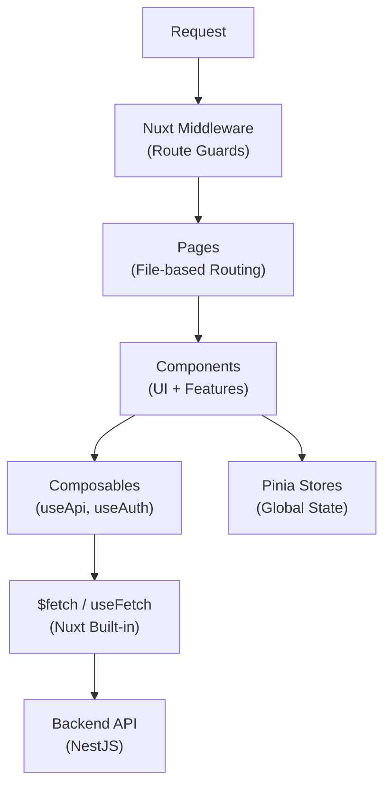

# Nuxt.js — AI Coding Rules

> **PURPOSE:** This document defines architecture patterns for Nuxt.js applications.  
> **AUDIENCE:** AI agents designing, generating, or reviewing Nuxt.js code.  
> **STACK:** Nuxt 3.x + Vue 3.x + TypeScript + Vuetify 3.x / Tailwind + Pinia

---

## 1) System Architecture



**Boundaries:**
- **Pages**: Route components, data loading with `useFetch`/`useAsyncData`
- **Components**: Reusable UI, feature-specific components
- **Composables**: Shared logic, API integration
- **Stores**: Global client state (Pinia)

---

## 2) Folder Structure

```
apps/web/
├── nuxt.config.ts                # Nuxt configuration
├── app.vue                       # Root component
│
├── pages/                        # 📄 File-based Routing
│   ├── index.vue                 # Home page
│   ├── auth/
│   │   ├── login.vue
│   │   └── register.vue
│   └── backend/                  # Admin pages (convention)
│       ├── index.vue             # Dashboard
│       └── collection/
│           ├── index.vue         # List page
│           ├── add.vue           # Create page
│           └── [id]/
│               ├── index.vue     # Detail page
│               └── edit.vue      # Edit page
│
├── components/
│   ├── common/                   # 🎨 Shared components
│   │   ├── AppPagination.vue
│   │   ├── AppTable.vue
│   │   └── AppDialog.vue
│   │
│   ├── layout/                   # Layout components
│   │   ├── AppHeader.vue
│   │   ├── AppSidebar.vue
│   │   └── AppFooter.vue
│   │
│   └── features/                 # Feature-specific
│       └── collection/
│           ├── CollectionForm.vue
│           └── CollectionCard.vue
│
├── composables/                  # 🔧 Vue Composables
│   ├── useApi.ts                 # API wrapper
│   ├── useAuth.ts                # Auth logic
│   └── usePagination.ts          # Pagination logic
│
├── stores/                       # 📦 Pinia Stores
│   ├── user.ts
│   └── ui.ts
│
├── middleware/                   # 🛡️ Route Middleware
│   └── auth.ts
│
├── layouts/                      # 🖼️ Layouts
│   ├── default.vue
│   ├── blank.vue
│   └── backend.vue
│
├── plugins/                      # 🔌 Nuxt Plugins
│   └── vuetify.ts
│
├── types/                        # TypeScript types
│   ├── api.ts
│   └── entities.ts
│
├── utils/                        # Utility functions
│   └── format.ts
│
└── assets/
    └── styles/
        └── main.scss
```

---

## 3) Polyrepo vs Monorepo

### Polyrepo Structure
```
project/
├── frontend/
│   └── (nuxt structure above)
└── backend/
```

### Monorepo Structure (Turborepo)
```
project/
├── apps/
│   ├── web/                      # Nuxt app
│   └── api/                      # NestJS
├── packages/
│   └── shared/
└── turbo.json
```

### Path Aliases

**nuxt.config.ts:**
```typescript
export default defineNuxtConfig({
  alias: {
    '@': '/<srcDir>',
  },
})
```

**tsconfig.json:**
```json
{
  "compilerOptions": {
    "paths": {
      "@/*": ["./*"]
    }
  }
}
```

---

## 4) Data Fetching

### Pattern 1: useFetch (Recommended)
```vue
<script setup lang="ts">
const { data: collections, pending, error, refresh } = await useFetch<Collection[]>(
  '/api/v1/collections',
  {
    query: { page: 1, perPage: 10 },
  }
)
</script>
```

### Pattern 2: useAsyncData (Custom Logic)
```vue
<script setup lang="ts">
const route = useRoute()

const { data: collection } = await useAsyncData(
  `collection-${route.params.id}`,
  () => $fetch<Collection>(`/api/v1/collections/${route.params.id}`)
)
</script>
```

### Pattern 3: useApi Composable (Centralized)
```typescript
// composables/useApi.ts
export function useApi<T>(endpoint: string, options?: UseFetchOptions<T>) {
  const config = useRuntimeConfig()
  
  return useFetch<T>(`${config.public.apiBase}${endpoint}`, {
    ...options,
    credentials: 'include',
    onResponseError({ response }) {
      if (response.status === 401) {
        navigateTo('/auth/login')
      }
    },
  })
}

// Usage in component
const { data, pending, error } = await useApi<Collection[]>('/collections')
```

---

## 5) State Management

### Server State (useFetch)
- API data fetched via `useFetch` / `useAsyncData`
- Automatically cached by Nuxt

### Global State (Pinia)
```typescript
// stores/user.ts
export const useUserStore = defineStore('user', () => {
  const user = ref<User | null>(null)
  const isAuthenticated = computed(() => !!user.value)

  async function fetchUser() {
    const { data } = await useApi<User>('/auth/me')
    user.value = data.value
  }

  function logout() {
    user.value = null
    navigateTo('/auth/login')
  }

  return { user, isAuthenticated, fetchUser, logout }
})
```

### Rules
- **useFetch** — API data (server state)
- **Pinia** — Global client state (auth, UI preferences)
- **URL State** — Filters, pagination (useRoute)
- **ref/reactive** — Local component state

---

## 6) API Integration

### Runtime Config
```typescript
// nuxt.config.ts
export default defineNuxtConfig({
  runtimeConfig: {
    public: {
      apiBase: process.env.NUXT_PUBLIC_API_BASE || 'http://localhost:3000/api/v1',
    },
  },
})
```

### API Composable with Error Handling
```typescript
// composables/useApi.ts
export function useApi<T>(endpoint: string, options?: UseFetchOptions<T>) {
  const config = useRuntimeConfig()
  const toast = useToast()

  return useFetch<ApiResponse<T>>(`${config.public.apiBase}${endpoint}`, {
    ...options,
    credentials: 'include',
    
    transform: (response) => response.data,
    
    onResponseError({ response }) {
      const status = response.status
      
      if (status === 401) {
        navigateTo('/auth/login')
      } else if (status === 403) {
        toast.error('Permission denied')
      } else if (status >= 500) {
        toast.error('Server error. Please try again.')
      }
    },
  })
}
```

---

## 7) Layouts

### Default Layout
```vue
<!-- layouts/default.vue -->
<template>
  <div class="min-h-screen">
    <AppHeader />
    <main class="container mx-auto p-4">
      <slot />
    </main>
    <AppFooter />
  </div>
</template>
```

### Backend Layout (Admin)
```vue
<!-- layouts/backend.vue -->
<template>
  <div class="flex min-h-screen">
    <AppSidebar />
    <div class="flex-1">
      <AppHeader />
      <main class="p-6">
        <slot />
      </main>
    </div>
  </div>
</template>
```

### Page Layout Assignment
```vue
<!-- pages/backend/index.vue -->
<script setup lang="ts">
definePageMeta({
  layout: 'backend',
  middleware: 'auth',
})
</script>
```

---

## 8) Middleware (Route Guards)

### Auth Middleware
```typescript
// middleware/auth.ts
export default defineNuxtRouteMiddleware((to) => {
  const userStore = useUserStore()

  if (!userStore.isAuthenticated) {
    return navigateTo('/auth/login')
  }
})
```

### Guest Middleware
```typescript
// middleware/guest.ts
export default defineNuxtRouteMiddleware(() => {
  const userStore = useUserStore()

  if (userStore.isAuthenticated) {
    return navigateTo('/backend')
  }
})
```

### Page Usage
```vue
<script setup lang="ts">
definePageMeta({
  middleware: ['auth'],
})
</script>
```

---

## 9) Environment Variables

### Type-Safe Config
```typescript
// nuxt.config.ts
export default defineNuxtConfig({
  runtimeConfig: {
    // Server-only (not exposed to client)
    jwtSecret: process.env.JWT_SECRET,
    
    // Public (exposed to client)
    public: {
      apiBase: process.env.NUXT_PUBLIC_API_BASE || 'http://localhost:3000/api/v1',
      appUrl: process.env.NUXT_PUBLIC_APP_URL || 'http://localhost:3001',
    },
  },
})
```

### Usage
```typescript
// In composables/components
const config = useRuntimeConfig()
const apiUrl = config.public.apiBase

// In server routes
const config = useRuntimeConfig()
const secret = config.jwtSecret // Server-only
```

---

## 10) SEO & Meta

### Page Meta
```vue
<script setup lang="ts">
useSeoMeta({
  title: 'My Collections',
  description: 'Manage your book and media collections',
  ogTitle: 'My Collections',
  ogType: 'website',
})
</script>
```

### Dynamic Meta
```vue
<script setup lang="ts">
const route = useRoute()
const { data: collection } = await useApi<Collection>(`/collections/${route.params.id}`)

useSeoMeta({
  title: () => collection.value?.title || 'Collection',
  description: () => collection.value?.description,
})
</script>
```

---

## 11) Error Handling

### Error Page
```vue
<!-- error.vue -->
<script setup lang="ts">
const props = defineProps<{
  error: {
    statusCode: number
    message: string
  }
}>()

const handleError = () => clearError({ redirect: '/' })
</script>

<template>
  <div class="flex flex-col items-center justify-center min-h-screen">
    <h1 class="text-4xl font-bold">{{ error.statusCode }}</h1>
    <p class="mt-2">{{ error.message }}</p>
    <button @click="handleError" class="mt-4 btn">
      Go Home
    </button>
  </div>
</template>
```

### Component Error Handling
```vue
<script setup lang="ts">
const { data, error, pending } = await useApi<Collection[]>('/collections')
</script>

<template>
  <div v-if="pending">
    <AppSkeleton />
  </div>
  <div v-else-if="error">
    <AppError :error="error" />
  </div>
  <div v-else>
    <CollectionList :items="data" />
  </div>
</template>
```

---

## 12) Testing Strategy

### Test Structure
```
tests/
├── components/
│   └── CollectionCard.test.ts
├── composables/
│   └── useApi.test.ts
└── pages/
    └── collection.test.ts
```

### Component Test (Vitest)
```typescript
// tests/components/CollectionCard.test.ts
import { mount } from '@vue/test-utils'
import { describe, it, expect } from 'vitest'
import CollectionCard from '~/components/features/collection/CollectionCard.vue'

describe('CollectionCard', () => {
  it('renders collection title', () => {
    const wrapper = mount(CollectionCard, {
      props: { collection: { id: '1', title: 'Test' } },
    })
    expect(wrapper.text()).toContain('Test')
  })
})
```

---

## 13) File Naming Conventions

| Type | Pattern | Example |
|------|---------|---------|
| Page | `kebab-case.vue` | `collection-list.vue` |
| Component | `PascalCase.vue` | `CollectionCard.vue` |
| Composable | `use{Name}.ts` | `useAuth.ts` |
| Store | `{name}.ts` | `user.ts` |
| Middleware | `{name}.ts` | `auth.ts` |
| Layout | `{name}.vue` | `backend.vue` |
| Types | `{name}.ts` | `entities.ts` |

---

## 14) AI Coding Checklist

Before generating code:

- [ ] **Page:** In `pages/` folder with correct layout?
- [ ] **Data Fetching:** Using `useFetch` or `useApi`?
- [ ] **definePageMeta:** Layout and middleware set?
- [ ] **v-if/v-else:** Loading, error, and data states handled?
- [ ] **Form Validation:** Using VeeValidate or custom?
- [ ] **SEO:** Using `useSeoMeta` for important pages?
- [ ] **Auth:** Protected routes use `middleware: 'auth'`?
- [ ] **Path Alias:** Using `@/` or `~/` imports?
- [ ] **Components:** In correct folder (common/features)?
- [ ] **Environment:** Using `useRuntimeConfig()`?

---

## 15) Coding Standards

**Reference:** See `coding-standards.md` for detailed style guide.

**Quick Rules:**
- Components: Use `<script setup lang="ts">`
- Props: Use `defineProps<{}>()` with TypeScript
- Emits: Use `defineEmits<{}>()`
- Composables: Return object with refs and functions

---

*End of Architecture Rules*
