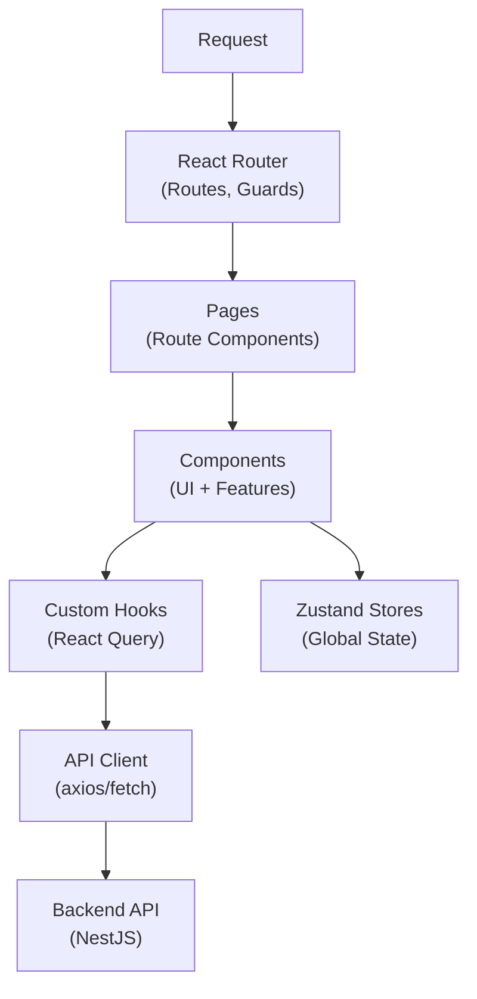

# React + Vite SPA — AI Coding Rules

> **PURPOSE:** This document defines architecture patterns for React + Vite SPA applications.  
> **AUDIENCE:** AI agents designing, generating, or reviewing React SPA code.  
> **STACK:** React 19.x + Vite 7.x + TypeScript + React Router + React Query + Zustand + Tailwind

---

## 1) System Architecture



**Boundaries:**
- **Pages**: Route components, data loading, layout assignment
- **Components**: Reusable UI, feature-specific components
- **Hooks**: Data fetching, business logic encapsulation
- **API Client**: Centralized HTTP requests
- **Stores**: Client-side global state

---

## 2) Folder Structure

```
apps/web/src/
├── main.tsx                      # Entry point
├── App.tsx                       # Root component + Router
├── vite-env.d.ts                 # Vite types
│
├── routes/                       # 🗺️ Route Configuration
│   ├── index.tsx                 # Route definitions
│   ├── guards/                   # Route guards
│   │   └── auth-guard.tsx
│   └── layouts/                  # Route layouts
│       ├── main-layout.tsx
│       └── auth-layout.tsx
│
├── pages/                        # 📄 Page Components
│   ├── home/
│   │   └── index.tsx
│   ├── auth/
│   │   ├── login.tsx
│   │   └── register.tsx
│   └── collection/
│       ├── index.tsx             # List page
│       └── [id].tsx              # Detail page
│
├── components/
│   ├── ui/                       # 🎨 UI Components (shadcn/ui)
│   │   ├── button.tsx
│   │   ├── card.tsx
│   │   └── ...
│   │
│   ├── layout/                   # Layout components
│   │   ├── header.tsx
│   │   ├── sidebar.tsx
│   │   └── footer.tsx
│   │
│   └── features/                 # Feature components
│       └── collection/
│           ├── collection-list.tsx
│           ├── collection-card.tsx
│           └── collection-form.tsx
│
├── hooks/                        # Custom hooks
│   ├── queries/                  # React Query hooks
│   │   ├── use-collections.ts
│   │   └── use-collection.ts
│   ├── mutations/                # Mutation hooks
│   │   └── use-create-collection.ts
│   └── use-auth.ts
│
├── lib/                          # Utilities
│   ├── api-client.ts             # HTTP client
│   ├── utils.ts                  # cn() helper
│   └── validations/              # Zod schemas
│       └── collection.ts
│
├── stores/                       # Zustand stores
│   ├── auth-store.ts
│   └── ui-store.ts
│
├── types/                        # TypeScript types
│   ├── api.ts                    # API response types
│   └── entities.ts               # Domain entities
│
├── config/                       # Configuration
│   └── env.ts                    # Environment variables
│
└── styles/
    └── globals.css               # Tailwind + theme
```

---

## 3) Polyrepo vs Monorepo

### Polyrepo Structure
```
project/
├── src/
│   ├── pages/
│   ├── components/
│   └── ...
├── public/
├── index.html
└── package.json
```

### Monorepo Structure (Turborepo)
```
project/
├── apps/
│   └── web/                      # React + Vite app
│       └── src/
├── packages/
│   └── shared/                   # Shared types/utils
└── turbo.json
```

### Path Aliases

**vite.config.ts:**
```typescript
import { defineConfig } from 'vite'
import react from '@vitejs/plugin-react'
import path from 'path'

export default defineConfig({
  plugins: [react()],
  resolve: {
    alias: {
      '@': path.resolve(__dirname, './src'),
    },
  },
})
```

**tsconfig.json:**
```json
{
  "compilerOptions": {
    "baseUrl": ".",
    "paths": {
      "@/*": ["./src/*"]
    }
  }
}
```

---

## 4) Routing (React Router v7)

### Route Configuration
```tsx
// routes/index.tsx
import { createBrowserRouter, RouterProvider } from 'react-router-dom'
import { MainLayout } from './layouts/main-layout'
import { AuthLayout } from './layouts/auth-layout'
import { AuthGuard } from './guards/auth-guard'

const router = createBrowserRouter([
  {
    path: '/login',
    element: <AuthLayout />,
    children: [
      { index: true, lazy: () => import('@/pages/auth/login') },
    ],
  },
  {
    path: '/',
    element: (
      <AuthGuard>
        <MainLayout />
      </AuthGuard>
    ),
    children: [
      { index: true, lazy: () => import('@/pages/home') },
      { path: 'collection', lazy: () => import('@/pages/collection') },
      { path: 'collection/:id', lazy: () => import('@/pages/collection/[id]') },
    ],
  },
])

export function AppRouter() {
  return <RouterProvider router={router} />
}
```

### Auth Guard
```tsx
// routes/guards/auth-guard.tsx
import { Navigate, useLocation } from 'react-router-dom'
import { useAuthStore } from '@/stores/auth-store'

interface AuthGuardProps {
  children: React.ReactNode
}

export function AuthGuard({ children }: AuthGuardProps) {
  const isAuthenticated = useAuthStore((state) => state.isAuthenticated)
  const location = useLocation()

  if (!isAuthenticated) {
    return <Navigate to="/login" state={{ from: location }} replace />
  }

  return <>{children}</>
}
```

### Lazy Loading Pages
```tsx
// pages/collection/index.tsx
export function Component() {
  return <CollectionListPage />
}

Component.displayName = 'CollectionPage'
```

---

## 5) Data Fetching (React Query)

### Query Provider Setup
```tsx
// main.tsx
import { QueryClient, QueryClientProvider } from '@tanstack/react-query'
import { useState } from 'react'

function App() {
  const [queryClient] = useState(() => new QueryClient({
    defaultOptions: {
      queries: {
        staleTime: 60 * 1000,
        retry: 1,
      },
    },
  }))

  return (
    <QueryClientProvider client={queryClient}>
      <AppRouter />
    </QueryClientProvider>
  )
}
```

### Query Hooks
```tsx
// hooks/queries/use-collections.ts
import { useQuery } from '@tanstack/react-query'
import { apiClient } from '@/lib/api-client'

export function useCollections(params?: CollectionsParams) {
  return useQuery({
    queryKey: ['collections', params],
    queryFn: () => apiClient.get<PaginatedResponse<Collection>>('/collections', params),
  })
}

export function useCollection(id: string) {
  return useQuery({
    queryKey: ['collection', id],
    queryFn: () => apiClient.get<Collection>(`/collections/${id}`),
    enabled: !!id,
  })
}
```

### Mutation Hooks
```tsx
// hooks/mutations/use-create-collection.ts
import { useMutation, useQueryClient } from '@tanstack/react-query'
import { apiClient } from '@/lib/api-client'

export function useCreateCollection() {
  const queryClient = useQueryClient()

  return useMutation({
    mutationFn: (data: CreateCollectionInput) =>
      apiClient.post<Collection>('/collections', data),
    onSuccess: () => {
      queryClient.invalidateQueries({ queryKey: ['collections'] })
    },
  })
}
```

---

## 6) State Management

### Server State (React Query)
- API data, collections, user data
- Use hooks in `hooks/queries/` and `hooks/mutations/`

### Global State (Zustand)
```tsx
// stores/auth-store.ts
import { create } from 'zustand'
import { persist } from 'zustand/middleware'

interface AuthState {
  user: User | null
  isAuthenticated: boolean
  setUser: (user: User | null) => void
  logout: () => void
}

export const useAuthStore = create<AuthState>()(
  persist(
    (set) => ({
      user: null,
      isAuthenticated: false,
      setUser: (user) => set({ user, isAuthenticated: !!user }),
      logout: () => set({ user: null, isAuthenticated: false }),
    }),
    { name: 'auth-storage' }
  )
)
```

### UI State (Zustand)
```tsx
// stores/ui-store.ts
import { create } from 'zustand'

interface UIState {
  isSidebarOpen: boolean
  toggleSidebar: () => void
}

export const useUIStore = create<UIState>((set) => ({
  isSidebarOpen: true,
  toggleSidebar: () => set((state) => ({ isSidebarOpen: !state.isSidebarOpen })),
}))
```

### Rules
- **React Query** — Server data (API responses)
- **Zustand** — Client state (auth, UI preferences)
- **URL State** — Filters, pagination (useSearchParams)
- **React State** — Form inputs, local UI state

---

## 7) API Integration

### API Client with Interceptors
```typescript
// lib/api-client.ts
import { env } from '@/config/env'

class ApiClient {
  private async request<T>(endpoint: string, options?: RequestInit): Promise<T> {
    const res = await fetch(`${env.VITE_API_URL}${endpoint}`, {
      ...options,
      headers: {
        'Content-Type': 'application/json',
        ...options?.headers,
      },
      credentials: 'include',
    })

    // Handle 401 Unauthorized
    if (res.status === 401) {
      // Clear auth state and redirect
      window.location.href = '/login'
      throw new ApiError('UNAUTHORIZED', 'Session expired', 401)
    }

    if (!res.ok) {
      const error = await res.json().catch(() => ({}))
      throw new ApiError(
        error.code || 'UNKNOWN_ERROR',
        error.message || 'An error occurred',
        res.status
      )
    }

    const json = await res.json()
    return json.data
  }

  get<T>(endpoint: string, params?: Record<string, any>) {
    const url = params ? `${endpoint}?${new URLSearchParams(params)}` : endpoint
    return this.request<T>(url)
  }

  post<T>(endpoint: string, data: unknown) {
    return this.request<T>(endpoint, {
      method: 'POST',
      body: JSON.stringify(data),
    })
  }

  put<T>(endpoint: string, data: unknown) {
    return this.request<T>(endpoint, {
      method: 'PUT',
      body: JSON.stringify(data),
    })
  }

  patch<T>(endpoint: string, data: unknown) {
    return this.request<T>(endpoint, {
      method: 'PATCH',
      body: JSON.stringify(data),
    })
  }

  delete<T>(endpoint: string) {
    return this.request<T>(endpoint, { method: 'DELETE' })
  }
}

export const apiClient = new ApiClient()
```

### Error Class
```typescript
export class ApiError extends Error {
  constructor(
    public code: string,
    message: string,
    public status?: number
  ) {
    super(message)
    this.name = 'ApiError'
  }
}
```

---

## 8) Environment Variables

### Type-Safe Environment
```typescript
// config/env.ts
import { z } from 'zod'

const envSchema = z.object({
  VITE_API_URL: z.string().url().default('http://localhost:3000/api/v1'),
  VITE_APP_URL: z.string().url().default('http://localhost:5173'),
})

export const env = envSchema.parse({
  VITE_API_URL: import.meta.env.VITE_API_URL,
  VITE_APP_URL: import.meta.env.VITE_APP_URL,
})

export type Env = z.infer<typeof envSchema>
```

### Usage
```typescript
// ✅ CORRECT
import { env } from '@/config/env'
const response = await fetch(`${env.VITE_API_URL}/collections`)

// ❌ AVOID
const response = await fetch(`${import.meta.env.VITE_API_URL}/collections`)
```

---

## 9) Layouts

### Main Layout
```tsx
// routes/layouts/main-layout.tsx
import { Outlet } from 'react-router-dom'
import { Header } from '@/components/layout/header'
import { Sidebar } from '@/components/layout/sidebar'

export function MainLayout() {
  return (
    <div className="flex min-h-screen">
      <Sidebar />
      <div className="flex-1">
        <Header />
        <main className="p-6">
          <Outlet />
        </main>
      </div>
    </div>
  )
}
```

### Auth Layout
```tsx
// routes/layouts/auth-layout.tsx
import { Outlet } from 'react-router-dom'

export function AuthLayout() {
  return (
    <div className="flex min-h-screen items-center justify-center bg-gray-50">
      <div className="w-full max-w-md">
        <Outlet />
      </div>
    </div>
  )
}
```

---

## 10) Error Handling

### Error Boundary
```tsx
// components/error-boundary.tsx
import { Component, ErrorInfo, ReactNode } from 'react'
import { Button } from '@/components/ui/button'

interface Props {
  children: ReactNode
  fallback?: ReactNode
}

interface State {
  hasError: boolean
  error?: Error
}

export class ErrorBoundary extends Component<Props, State> {
  state: State = { hasError: false }

  static getDerivedStateFromError(error: Error): State {
    return { hasError: true, error }
  }

  componentDidCatch(error: Error, errorInfo: ErrorInfo) {
    console.error('Error boundary caught:', error, errorInfo)
  }

  render() {
    if (this.state.hasError) {
      return this.props.fallback || (
        <div className="flex flex-col items-center justify-center p-8">
          <h2 className="text-xl font-semibold">Something went wrong</h2>
          <p className="text-muted-foreground">{this.state.error?.message}</p>
          <Button onClick={() => window.location.reload()} className="mt-4">
            Reload page
          </Button>
        </div>
      )
    }

    return this.props.children
  }
}
```

### Query Error Handling
```tsx
export function CollectionList() {
  const { data, isLoading, error } = useCollections()

  if (isLoading) return <CollectionListSkeleton />
  if (error) return <ErrorMessage error={error} />
  if (!data?.length) return <EmptyState />

  return (
    <div className="grid gap-4">
      {data.map(item => <CollectionCard key={item.id} collection={item} />)}
    </div>
  )
}
```

---

## 11) Testing Strategy

### Test Structure
```
src/
├── __tests__/
│   ├── components/
│   │   └── collection-card.test.tsx
│   ├── hooks/
│   │   └── use-collections.test.ts
│   └── pages/
│       └── collection.test.tsx
├── test/
│   ├── setup.ts                  # Vitest setup
│   └── test-utils.tsx            # Custom render
└── ...
```

### Test Setup
```typescript
// test/setup.ts
import '@testing-library/jest-dom/vitest'
import { cleanup } from '@testing-library/react'
import { afterEach } from 'vitest'

afterEach(() => {
  cleanup()
})
```

### Custom Render
```tsx
// test/test-utils.tsx
import { QueryClient, QueryClientProvider } from '@tanstack/react-query'
import { BrowserRouter } from 'react-router-dom'
import { render } from '@testing-library/react'

export function createTestQueryClient() {
  return new QueryClient({
    defaultOptions: {
      queries: { retry: false },
    },
  })
}

export function renderWithProviders(ui: React.ReactElement) {
  const queryClient = createTestQueryClient()
  
  return render(
    <QueryClientProvider client={queryClient}>
      <BrowserRouter>
        {ui}
      </BrowserRouter>
    </QueryClientProvider>
  )
}
```

---

## 12) File Naming Conventions

| Type | Pattern | Example |
|------|---------|---------|
| Page | `index.tsx` or `[param].tsx` | `pages/collection/index.tsx` |
| Component | `kebab-case.tsx` | `collection-card.tsx` |
| Hook | `use-{name}.ts` | `use-collections.ts` |
| Store | `{name}-store.ts` | `auth-store.ts` |
| Validation | `{name}.ts` | `collection.ts` |
| Type | `{name}.ts` | `entities.ts` |
| Layout | `{name}-layout.tsx` | `main-layout.tsx` |
| Guard | `{name}-guard.tsx` | `auth-guard.tsx` |

---

## 13) AI Coding Checklist

Before generating code:

- [ ] **Page Component:** In `pages/` folder?
- [ ] **Data Fetching:** Using React Query hook?
- [ ] **Form Validation:** Using Zod schema?
- [ ] **Loading State:** Using Skeleton component?
- [ ] **Error Handling:** Using Error Boundary or error state?
- [ ] **API Client:** Using centralized apiClient?
- [ ] **State:** React Query for server data, Zustand for client?
- [ ] **Routing:** Using lazy loading for pages?
- [ ] **Auth:** Protected routes use AuthGuard?
- [ ] **Path Alias:** Using @/ imports?
- [ ] **Environment:** Using typed env from config/env.ts?

---

## 14) Coding Standards

**Reference:** See `coding-standards.md` for detailed style guide.

**Quick Rules:**
- Components: Use function declarations, not arrow functions
- Props: Define interface with `Props` suffix
- Hooks: Start with `use`, return object
- Styling: Use Tailwind, cn() helper for conditionals

---

*End of Architecture Rules*
