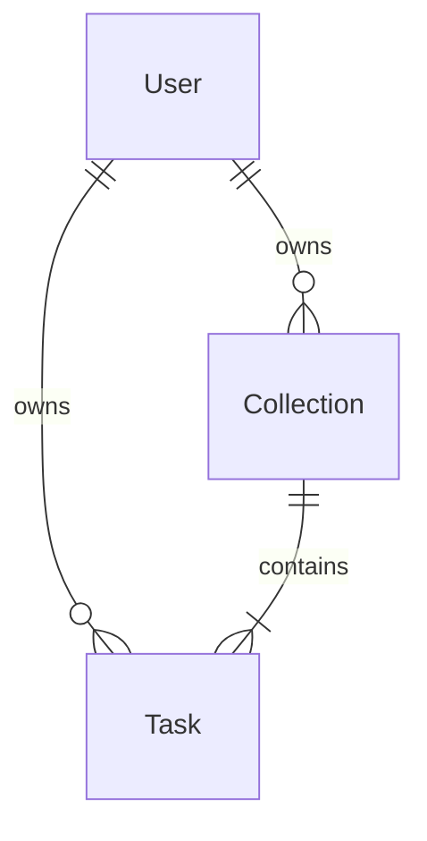

# Domain Model — Task Management System

## 1. Core Entities

### User
| Attribute | Type | Required | Description |
|-----------|------|----------|-------------|
| id | UUID | Yes | Primary key |
| email | String | Yes | Unique, login identifier |
| password | String | Yes | Bcrypt hashed |
| name | String | No | Display name |
| createdAt | DateTime | Yes | Auto-generated |
| updatedAt | DateTime | Yes | Auto-updated |
| deletedAt | DateTime | No | Soft delete timestamp |

### Collection
> **Definition:** A container for grouping tasks (e.g., "Personal", "Work", "Inbox").

| Attribute | Type | Required | Description |
|-----------|------|----------|-------------|
| id | UUID | Yes | Primary key |
| title | String | Yes | List name |
| color | String | No | Hex color code (e.g., #FF0000) |
| isDefault | Boolean | Yes | True for "Inbox" (cannot be deleted) |
| userId | UUID | Yes | Owner |
| createdAt | DateTime | Yes | Auto-generated |
| updatedAt | DateTime | Yes | Auto-updated |
| deletedAt | DateTime | No | Soft delete timestamp |

### Task
| Attribute | Type | Required | Description |
|-----------|------|----------|-------------|
| id | UUID | Yes | Primary key |
| title | String | Yes | Task description |
| description | String | No | Detailed notes |
| status | String | Yes | Mapped to `TaskStatus` Enum |
| priority | String | Yes | Mapped to `TaskPriority` Enum |
| dueDate | DateTime | No | Target completion date |
| userId | UUID | Yes | Owner (Denormalized for performance) |
| collectionId | UUID | Yes | Parent list (Required) |
| createdAt | DateTime | Yes | Auto-generated |
| updatedAt | DateTime | Yes | Auto-updated |
| deletedAt | DateTime | No | Soft delete timestamp |

## 2. Enums & Status Values

> **Note:** Database stores these as `String` (VARCHAR). Application enforces Enum constraints.

### TaskStatus
| Value | Description |
|-------|-------------|
| `todo` | Task is pending (Default) |
| `completed` | Task is finished |

### TaskPriority
| Value | Description |
|-------|-------------|
| `low` | Nice to do |
| `medium` | Standard priority (Default) |
| `high` | Urgent / Important |

## 3. Entity Relationships

| Relationship | Type | Description |
|--------------|------|-------------|
| User → Collection | 1:N | User creates multiple lists |
| User → Task | 1:N | Direct ownership (for "My Tasks" query) |
| Collection → Task | 1:N | **Strong Composition.** Task must belong to a Collection. |

## 4. Ubiquitous Language (Glossary)

| Term | Definition | ❌ Avoid |
|------|------------|----------|
| **Collection** | A named group of tasks. | "Project", "Folder", "List" (use Collection internally) |
| **Inbox** | The default Collection created for every new user. | "Default List" |
| **Task** | An actionable item with a status and priority. | "Todo", "Item" |
| **Soft Delete** | Marking a record as deleted (`deletedAt`) without removing it. | "Archive", "Remove" |

## 5. Business Rules

1.  **Default Collection:** Every User MUST have exactly one default Collection ("Inbox") created upon registration.
2.  **No Orphans:** A Task MUST belong to a Collection.
3.  **Inbox Immunity:** The default Collection CANNOT be deleted.
4.  **Isolation:** Users can ONLY access their own Collections and Tasks.
5.  **Soft Deletion:** All entities support soft deletion. Queries must filter `deletedAt IS NULL` by default.

---
**Version:** 1.0
**Created:** Sat Jan 24 2026
**Status:** Active
