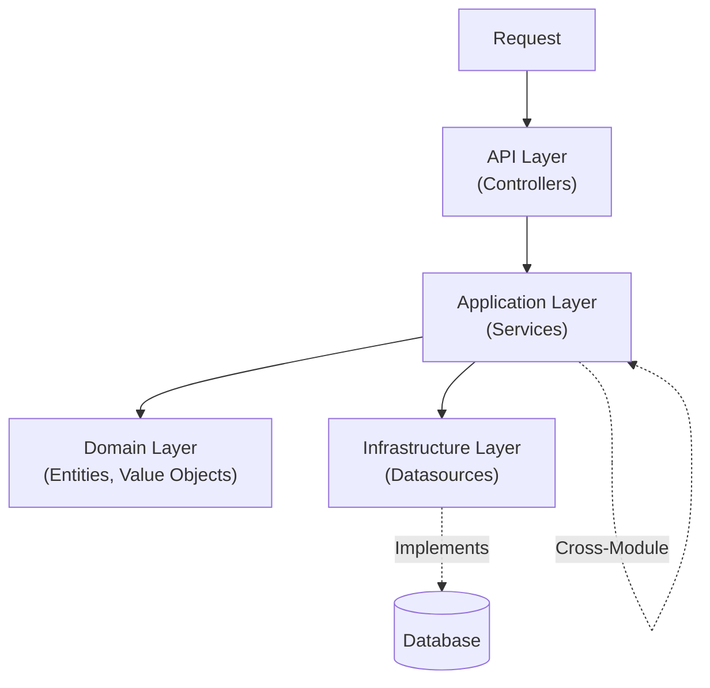

# System Principles — Task Management System

## 1. Architecture Pattern

**Pattern:** Strict Clean Architecture (Modular Monolith)
**Goal:** Decouple business logic from frameworks and external tools (UI, DB).

## 2. Layer Responsibilities

| Layer | Path | Responsibility | Can Access | Forbidden |
|-------|------|----------------|------------|-----------|
| **API** | `api/` | Controllers, DTOs, Swagger | Application | Business Logic, Database |
| **Application** | `application/` | Use Cases, Orchestration | Domain, Infrastructure (Interface) | Controllers, Prisma/SQL |
| **Domain** | `domain/` | Pure Business Rules, Entities | None (Pure) | External Libs, DB, Frameworks |
| **Infrastructure** | `infrastructure/` | DB Impl, External APIs | Database, 3rd Party Libs | Domain Logic |

## 3. Coding Standards (Strict)

### Naming Conventions
| Element | Convention | Example |
|---------|------------|---------|
| **Files** | kebab-case | `create-task.service.ts` |
| **Classes** | PascalCase | `CreateTaskService` |
| **Methods** | camelCase | `findTaskById()` |
| **Interfaces** | PascalCase | `TaskDatasource` (No "I" prefix) |
| **Constants** | SCREAMING_SNAKE | `MAX_RETRY_COUNT` |

### Error Handling
- **Pattern:** Use module-specific Exception Factories.
- **Rule:** NEVER throw generic `Error` or `HttpException` in Services.
- **Format:** All errors return a standardized JSON structure via Global Filter.

### DTO & Data Flow
- **Input:** `DTO` (API) → `Input Model` (Service)
- **Output:** `Entity` (Domain) → `Output Model` (Service) → `Response DTO` (API)
- **Strict Rule:** Services NEVER import DTOs. Controllers NEVER see Entities.

## 4. Forbidden Patterns (Critical)

| ❌ Forbidden | ✅ Correct Approach |
|--------------|---------------------|
| **Logic in Controller** | Move strictly to `Application Service`. |
| **Prisma in Service** | Inject `Datasource Interface`. Impl goes in `Infrastructure`. |
| **Hardcoded Routes** | Use `ROUTES` constant from `src/routes/app-routes.constant.ts`. |
| **Circular Imports** | Use `forwardRef()` and Interface-based DI. |
| **`any` Type** | Use strict types, Generics, or `unknown` with guards. |
| **Magic Numbers** | Extract to `constants/` or `enums`. |

## 5. Development Workflow Rules

1.  **Scaffolding:** Always create all 4 layers (`api`, `application`, `domain`, `infrastructure`) for new modules.
2.  **Transactions:** Use `@Transactional()` from `nestjs-cls` for data integrity.
3.  **Testing:**
    -   **Unit:** AAA Pattern (Arrange-Act-Assert).
    -   **Mocking:** Mock Datasource interfaces, never the DB driver directly.
4.  **Immutability:** Use `readonly` for all DTO/Model properties.

## 6. External Reference
For detailed implementation rules, refer to:
- `.opencode/refs/app-starter/nestjs/architecture-rules.md`
- `.opencode/refs/app-starter/nestjs/coding-standards.md`

---
**Version:** 1.0
**Created:** Sat Jan 24 2026
**Status:** Active
